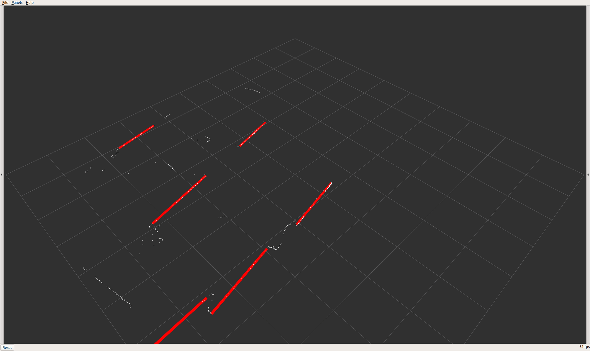

# Laser_Scan_Processor
Laser Scan Processor is a [Robot Operating System (ROS)](http://www.ros.org) package able to process information from [LaserScan](http://docs.ros.org/api/sensor_msgs/html/msg/LaserScan.html) messages. Currently the developed features are:
* Line extraction [1]
* Door detection

Here an example of the project in action:



## Usage
```
roslaunch laser_scan_processor run.launch
```

## Messages
Laser Line Extraction has two messages types:

#### LineSegment.msg
```
float32 radius
float32 angle
float32[4] covariance
float32[2] start
float32[2] end
```
`radius` (m) and `angle` (rad) are the polar parameterization of the line segment. `covariance` is the 2x2 covariance matrix of `radius` and `angle` (listed in row-major order). Finally `start` and `end` are the (x, y) coordinates of the start and end of the line segment.

#### LineSegmentList.msg
```
Header header
LineSegment[] line_segments
```
An array of LineSegment.msg with a header.

## Topics

Laser Line Extraction subscribes to a single topic and publishes one or two topics.

### Subscribed topics
- `/scan` ([sensor_msgs/LaserScan](http://docs.ros.org/api/sensor_msgs/html/msg/LaserScan.html))
	- The name of this topic can be configured (see Parameters).

### Published topics
- `/line_segments` (laser\_line\_extraction/LineSegmentList)
	- A list of line segments extracted from a laser scan.
- `/line_markers` ([visualization_msgs/Marker](http://docs.ros.org/api/visualization_msgs/html/msg/Marker.html))
	- (optional) Markers so that the extracted lines can be visualized in rviz (see above image). Can be toggled (see Parameters).
- `/door_markers` ([visualization_msgs/Marker](http://docs.ros.org/api/visualization_msgs/html/msg/Marker.html))
	- (optional) Markers so that the extracted door can be visualized in rviz (see above image). Can be toggled (see Parameters).

## References
[1] Marc Gallant, Laser Line Extraction, (2020), GitHub repository, https://github.com/kam3k/laser_line_extraction
